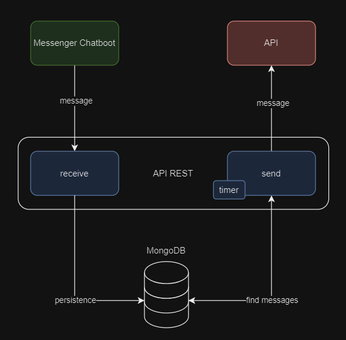
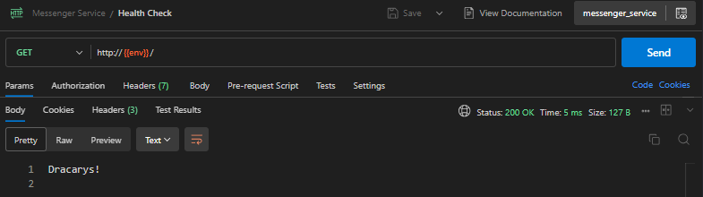
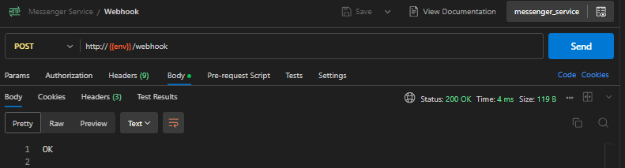
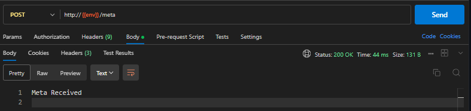

# Messenger Service
Esta é uma aplicação API REST desenvolvida em Golang, que simula a integração com chatboots do Messenger da Meta, onde ela recebe mensagens do chatboot, armazena em um banco de dados MongoDB, e durante intervalos determinados responde a outro endpoint. Além disso ela tem a capacidade de gerar logs das operações realizadas como mensagens recebidas e enviadas, erros e sucessos.

<details>
    <summary>Tecnologias Utilizadas</summary>
    
- Golang

- MongoDB

- Docker
</details>

<details>
    <summary>Padrões ou Conceitos Utilizados</summary>
    
- Singleton
- Usecases
- Gateways
- Entities
- Clean Archtecture
- Clean Code
</details>

<details>
    <summary>Fluxo</summary>
O fluxo da aplicação depende de interações de um sestema externo, que faz o envio de mensagens a nossa api, no endpoint esperado, neste momento nossa aoi recebe a mensagem, realiza uma validação para definir a resposta, e armazena em nosso banco de dados MongoDB.

Dentro do período determinado a aplicação buscará no banco de dados as mensagens que recebemos e que ainda não enviamos respostas, e faz o envio das respostas pendentes.

</details>

# Preparando o Ambiente
Para executar a aplicação será necessário ter o [Docker](https://docs.docker.com/engine/install/) instalado em sua máquina, sendo possível executar o container do banco de dados MongoDB e da própria aplicação. Além disso você deverá configurar as variáveis de ambiente no arquivo .env.

<details>
    <summary>MongoDB</summary>

> Caso você tenha o banco de dados instalado diretamente em sua máquina pode ignorar esta etapa e somente configuras as variáveis de embiente necessárias para integrar a aplicação ao banco. Fique à vontade para seguir um caminho alternativo para utilizar o MongoDB.

Supondo que a essa altura já tenha instalado o Docker em seu ambiente, abra seu terminal e execute os comandos a seguir.

Baixe a imagem do MongoDB:
```json
docker pull mongo
```
Execute o MongoDB em um conteiner Docker:
```json
docker run -d --name mongodb_container -e MONGO_INITDB_ROOT_USERNAME=<seu usuário> -e MONGO_INITDB_ROOT_PASSWORD=<sua senha> -e MONGO_INITDB_DATABASE=<nome do banco> -p 27017:27017 mongo:latest
```
Pronto, MongoDB preparado para trabalhar!
</details>

<details>
    <summary>Variáveis de Ambiente</summary>

Nesta etapa será necessário que criar um arquivo .env na raiz do projeto ou renomear o arquivo .env.example, para preencher as informações esperadas pela aplicação, por exemplo:
```json
#porta da aplicação
PORT="8000"
#origens habilitadas
ALLOWED_ORIGINS="*"

#credenciais do banco
MONGO_USER="admin"
MONGO_PASSWORD="1234"
MONGO_PORT="27017"
MONGO_HOST="10.11.112.113"
MONGO_COLLECTION="messages"
MONGO_DATABASE="messenger_service"

#configurações do logger
LOGGER_DATE_FORMAT="02/01/2006 15:04:05"
LOGGER_FOLDER="logs"
LOGGER_EXTENSION="log"

#habilitar printar os logs no console
PRINT_ENABLED="true"

#caminho do arquivo de mock de respostas
MOCK_PATH_FILE="./internal/mock/singleton.json"

#período de envio de respostas (minutos)
TIME_TO_SLEEP="2"

#url da meta ou do endpoint presente nesta própria aplicação para receber as respostas
META_URL="http://10.11.112.113:8000/meta"
#token da meta caso faça essa integração
META_TOKEN="token"
```
</details>

### Execução da Aplicação
Crie a imagem da aplicação com o seguinte comando:
```json
docker build -t messenger_service .
```
Execute a Aplicação com o comando:
```json
docker run -p 8000:8000 -v "$(pwd)/logs:/app/logs" messenger_service
```

# API REST
Depois de executar as etapas anteriores podemos validar se a aplicação esta realmente funcionando, para isso temos um rota de healthCheck, use o [Postman](https://www.postman.com/downloads/) para testar os endpoints da aplicação. Na raiz do projeto tem uma collection do postman para ser utilizada, assim não será necessário criar as requisições, basta importa-la no seu postman.

### Health Check
Se sua aplicação estiver de pé, deverá ter esse resultado na request:


### Webhook
Para testar o envio de mensagens ao servidor será necessário realizar uma requisição POST com a mensagem no Body, a mensagem pode ter ou não botões inclusos, pode ter apenas texto, segue os exemplos:

Apenas texto:
```json
{
    "id": "PAGE_ID",
    "time": 1458692752478,
    "messaging":[
        {
            "sender": {
                "id": "USER_ID"
            },
            "recipient":{
                "id": "PAGE_ID"
            },
            "timestamp": 1762902671,
            "message": {
                "mid": "mid.1457764197618:41d102a3e1ae206a38",
                "text": "ping"
            }
        }
    ]
}
```

Com botões:
```json
{
    "id": "PAGE_ID",
    "time": 1458692752478,
    "messaging": [
        {
            "sender": {
                "id": "USER_ID"
            },
            "recipient":{
                "id": "PAGE_ID"
            },
            "timestamp": 1762902671,
            "postback": {
                "mid":"mid.1457764197618:41d102a3e1ae206a38",
                "payload": "START_PAYLOAD"
            }
        }
    ]
}
```
Use estes exemplos em seu body e execute a requisição no postman, deverá ter um resultado como:



Em seu banco de dados MongoDB devera ser armazenado um arquivo como este:
```json
{
    "_id": {
        "$oid": "000000000000000000000000"
    },
    "received": {
        "id": "PAGE_ID",
        "time": {
            "$numberLong": "1458692752478"
        },
        "messaging": [
            {
                "sender": {
                    "id": "USER_ID"
                },
                "recipient": {
                    "id": "PAGE_ID"
                },
                "timestamp": 1762902671,
                "message": {
                    "mid": "",
                    "text": ""
                },
                "postback": {
                    "mid": "mid.1457764197618:41d102a3e1ae206a38",
                    "payload": "START_PAYLOAD"
                }
            }
        ]
    },
    "send": {
        "recipient": {
            "id": "USER_ID"
        },
        "message": {
            "text": "",
            "attachment": {
                "type": "template",
                "payload": {
                    "template_type": "button",
                    "text": "O que você gostaria de fazer a seguir?",
                    "buttons": [
                        {
                            "type": "postback",
                            "title": "Começar",
                            "payload": "START_PAYLOAD"
                        },
                        {
                            "type": "postback",
                            "title": "Ajuda",
                            "payload": "HELP_PAYLOAD"
                        }
                    ]
                }
            }
        }
    },
    "status": "Received"
}
```
Neste arquivo teremos armazenado a mensagem recebida no objeto "receive" e a mensagem que deverá ser enviada como resposta no objeto "send".

Perceba que no final do arquivo tem um campo "status", através dele podemos saber se a mensagem foi somente recebida, enviada, ou se houve algum problema ao tentar enviar, ele pode ter os seguintes valores:

* Received (Recebido e aguardando para ser enviado)
* Sended (Recebido e enviado com sucesso)
* Errored (Recebido com sucesso e falha ao enviar)

Sendo assim você já tem sua mensagem recebida e processada pela aplicação mas, e quanto ao envio da resposta?

### Send
O envio da resposta é feita dentro do período determinado em sua variávek de ambiente "TIME_SLEEP", onde a aplicação buscará as mensagens recebidas, ou seja, com status "Received" e enviará as respostas presentes no objeto "send", Caso o envio seja efetuado com sucesso, o campo "status" será atualizado com o valor "Sended", caso ocorra algum erro, o campo "status" será atualizado com o valor "Errored".

### Meta Endpoint
Existe um endpoint na própria aplicação criado para simular o envio de respostas para a Meta, onde ele apenas registra o log de que a mensagem foi recebida com sucesso. É uma requisição post onde ela espera a mensagem de resposta no body.



### Logs
Na raiz do projeto deverá ter uma pasta chamada "logs", que será onde serão escritos logs das operações ocorridas na aplicação, como o recebimento e envio de mansagens e possíveis erros que possam acontecer durante o processamento.